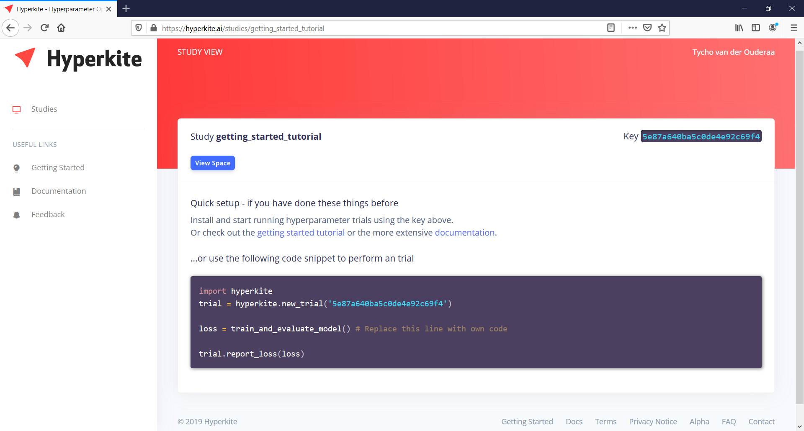

.. _Defining Hyperparameters:

************************
Defining Hyperparameters
************************

|
|

Sign in to Hyperkite_, and press the **Create Study** button.

.. figure:: _static/screenshot_a.png
    :scale: 50
    :figclass: align-center

Add or remove the hyperparameters that you wish to optimize. Each hyperparameter needs to have a unique name, and a specified range.

.. figure:: _static/screenshot_b.png
    :scale: 50
    :figclass: align-center
    
After creating the Study, you will obtain a so called Study ``key``. This key is used to let your Python code communicate with the defined Study.

   
Your good to go! To run experiments, check out :ref:`Running Experiments`.

.. _Hyperkite: https://hyperkite.ai/

Hyperparameter Types
====================

It is possible to select different hyperparameter types, such as an **Uniform Range** or a **Normal Distribution**.
Although hyperparameters can be easily selected using the interactive interface, it is also possible to specify an hyperparamer space in the `Hyperopt Format`_.
A summary of all hyperparameter types is shown in the table below.

.. raw:: html

    <table class="mb-1 table width-table align-items-center table-flush">
      <thead>
        <tr>
          <th scope="col">Parameter</th>
          <th scope="col">Best value</th>
          <th scope="col" style="min-width: 18rem;">Example in `Hyperopt Format` (<a href="https://github.com/hyperopt/hyperopt/wiki/FMin#21-parameter-expressions">?</a>)</th>
        </tr>
      </thead>
      <tbody>
        <tr>
          <td>
            

              

                <button class="btn btn-primary btn-param" style="pointer-events: none"> 
                  </img>
                </button>
              

            

          </td>
          <td>
            A <b>Categorical</b> defines a discrete (integer) hyperparameter as a <code class="docutils literal notrasnlate">number of categories</code>, <u>without any assumed correlation or ordering</u>. If the values are correlated with nearby integer values or if there is any ordering, you might be better off with a Discrete Range.
          </td>
          <td>
            <code class="docutils literal notranslate">
              
                hp.randint('seed', 10) 
              
            </code>
          </td>
        </tr>
        <tr>
          <td>
            

              

                <button class="btn btn-primary btn-param" style="pointer-events: none"> 
                  </img>
                </button>
              

            

          </td>
          <td>
            A <b>Uniform Range</b> defines a continuous (float) hyperparameter as a uniform range <code class="docutils literal notranslate">from</code> a value <code class="docutils literal notranslate">to</code> another number.
          </td>
          <td>
            <code class="docutils literal notranslate">
              
                hp.uniform('alpha', 0.0, 1.0)
              
            </code>
          </td>
        </tr>
        <tr>
          <td>
            

              

                <button class="btn btn-primary btn-param" style="pointer-events: none"> 
                  </img>
                </button>
              

            

          </td>
          <td>
            A <b>Discrete Uniform Range</b> defines a discrete (rounded) hyperparameter as a uniform range <code class="docutils literal notranslate">from</code> a value <code class="docutils literal notranslate">to</code> another number.
          </td>
          <td>
            <code class="docutils literal notranslate">
              
                hp.quniform('layers', 3, 8, 1)
              
            </code>
          </td>
        </tr>
        <tr>
          <td>
            

              

                <button class="btn btn-primary btn-param" style="pointer-events: none"> 
                  </img>
                </button>
              

            

          </td>
          <td>
            A <b>Normal Distribution</b> defines a continuous (float) hyperparameter as a normal distribution with a certain <code class="docutils literal notranslate">mean</code> and <code class="docutils literal notranslate">standard deviation</code>.
          </td>
          <td>
            <code class="docutils literal notranslate">
              
                hp.normal('normal', 34.0, 6.2)
              
            </code>
          </td>
        </tr>
        <tr>
          <td>
            

              

                <button class="btn btn-primary btn-param" style="pointer-events: none"> 
                  </img>
                </button>
              

            

          </td>
          <td>
            A <b>Discrete Normal Distribution</b> defines a discrete (rounded) hyperparameter as a normal distribution with a certain <code class="docutils literal notranslate">mean</code> and <code class="docutils literal notranslate">standard deviation</code>.
          </td>
          <td>
            <code class="docutils literal notranslate">
              
                hp.qnormal('translate', 0, 20, 1)
              
            </code>
          </td>
        </tr>
      </tbody>
    </table>

.. _Hyperopt Format: https://github.com/hyperopt/hyperopt/wiki/FMin#21-parameter-expressions
